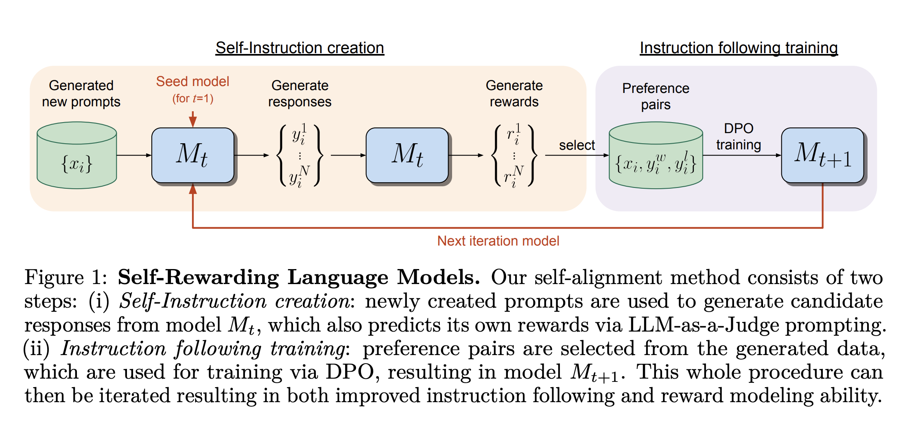
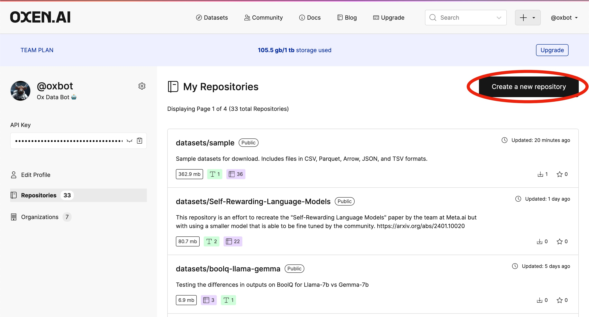
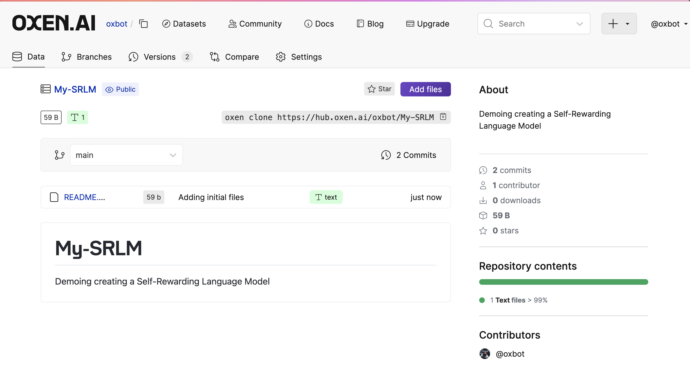

# 🐂 Oxen.ai Self-Rewarding Language Models 🔁

This is work done by the [Oxen.ai Community](https://oxen.ai/community), trying to reproduce the [Self-Rewarding Language Model paper](https://arxiv.org/abs/2401.10020) from MetaAI.

Every Friday we get together for a paper club called [Arxiv Dives](https://www.oxen.ai/community/arxiv-dives) where we read interesting research papers. We thought the Self-Rewarding Language Models paper felt very approachable and reproducible, so we spent some time implementing it.

</img>

If you want to learn more about Self-Rewarding Language Models you can find our deep dive on it [here](https://www.oxen.ai/blog/arxiv-dives-self-rewarding-language-models).

## 🤖 Goal

The goal is to have a single script that can take in a base LLM and put it into a Self-Reward loop. The initial experiments were run with `mistralai/Mistral-7B-v0.1` as the base model, but in theory could be run with any model.

```bash
./self-reward.sh scripts mistralai/Mistral-7B-v0.1 M0
```

Currently this script will get you from M0 to M1, but in theory we can wrap it in a loop and kick off a self-reward cycle.

## 🏃‍➡️ Steps

There are 5 main steps in each iteration of the Self-Rewarding loop.

0) [00_sft.py](scripts/00_sft.py) - Supervised Fine-Tuning (SFT) of a base model to give it instruction following and evaluation skills.
1) [01_gen_prompts.py](scripts/01_gen_prompts.py) - Generate new prompts to add to the training set.
2) [02_gen_responses.py](scripts/02_gen_responses.py) - Generate N Responses per prompt, so that we can create preference pairs.
3) [03_gen_scores.py](scripts/03_gen_scores.py) - Score each response from 1-5 for how well it answered the prompt.
4) [04_gen_preferences.py](scripts/04_gen_preferences.py) - Generate preference pairs given the scores to create a DPO dataset
5) [05_dpo.py](scripts/05_dpo.py) - Run Direct Preference Optimization (DPO) to train the next iteration of the model

## 🐂 Setup Oxen.ai

We use [Oxen.ai](https://oxen.ai) to version the intermediate models and datasets that are generated throughout the process.

If you are not familiar with Oxen.ai, it is an open source, blazing fast, version control system that is built from the ground up to handle large model files, large datasets, and large sets of multi-modal data that is a pain to version in git or git-lfs.

Feel free to checkout our [GitHub project](https://github.com/Oxen-AI/oxen-release) to learn more.

## 🌎 Create Remote Data Repository

If you have not already, create an account on [Oxen.ai](https://oxen.ai/register). This script is setup to upload all the intermediate steps to an Oxen.ai data repository so that we can explore the data the model is generating, as well as version each intermediate step.

Once you have an account, you can create your repository.

</img>

## 👨‍💻 Clone Locally

Clone a [data repository](https://docs.oxen.ai/getting-started/learn-the-basics) to your local machine to get Oxen ready to version the data.

```bash
export USERNAME=my-username
export REPOSITORY_NAME=my-repo-name
oxen clone https://hub.oxen.ai/$USERNAME/$REPOSITORY_NAME
cd $REPOSITORY_NAME
```

You can copy the command in the upper right hand corner of the page to get the exact URL to clone. In the screenshot below it is:

```bash
oxen clone https://hub.oxen.ai/oxbot/My-SRLM
```

</img>


## ⬇️ Download Starter Data

Download the initial datasets from our [datasets/Self-Rewarding-Language-Models](https://www.oxen.ai/datasets/Self-Rewarding-Language-Models) Oxen.ai data repository. We took care of cleaning up the initial datasets so you can copy them into your own reward loop.

```bash
mkdir -p M0/train
oxen download datasets/Self-Rewarding-Language-Models M0/train/ift_eft.jsonl -o M0/train
oxen download datasets/Self-Rewarding-Language-Models M0/train/ift.jsonl -o M0/train
```

Use the `add` and `commit` commands to track the initial training data and push it to your own Oxen.ai repository.

```bash
oxen add M0
oxen commit -m "adding initial ift & eft training data"
oxen push origin main
```

If you are familiar with git, the Oxen command line tool should be pretty intuitive.

## ⚽️ Kick it off

Run the self-reward.sh script to generate the first end to end model

```bash
./self-reward.sh scripts mistralai/Mistral-7B-v0.1 M0
```

TODO: Put this in a loop for M0, M1, M2, etc...